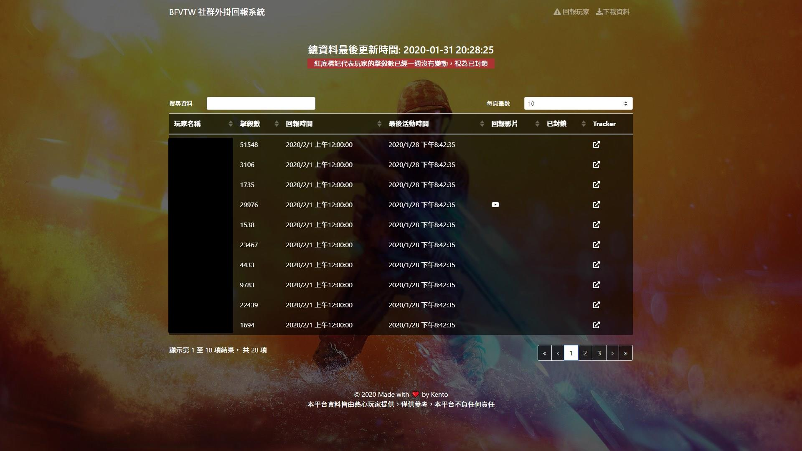

# BFVTW 社群外掛回報系統

## 系統需求
- PHP
- MYSQL
- APACHE
- Node.js (開發用)

## 安裝與建置
### 前台
- 切換至 `master` 分支
- 執行 `yarn` 安裝相依套件
- 在 `src/config.js` 填入設定
- `yarn serve` 開啟
- `yarn build` 建置
### 後台
- 切換至 `backend` 分支
- 在 `configs.php` 填入設定
